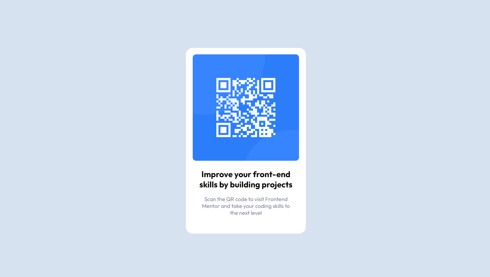

# Frontend Mentor - QR code component solution

This is a solution to the [QR code component challenge on Frontend Mentor](https://www.frontendmentor.io/challenges/qr-code-component-iux_sIO_H).

### Screenshot

### Links

- Solution URL: [Add solution URL here](https://your-solution-url.com)
- Live Site URL: [Add live site URL here](https://your-live-site-url.com)

## My process

### Built with

- Semantic HTML5 markup
- CSS custom properties
- Flexbox
- CSS Grid
- Mobile-first workflow

For this instance there was no need for anything more complicated.

### Continued development

Netlify used for deployment: [QR Code Component URL]()

## Author

- Website - [Andre Ferreira](https://www.andreferreiradev.com/)
- Frontend Mentor - [@Namonaki0](https://www.frontendmentor.io/profile/Namonaki0)
- Github - [Andre Ferreira - @Namonaki0](https://github.com/Namonaki0)
